# backstage-plugin-qeta

Backstage.io plugin for Q&A. This plugin is both frontend and backend that manages and displays questions and answers
within Backstage. This plugin provides:

- Support to ask and answer questions
- Support to write articles
- Support to vote questions, articles and answers
- Support to create collections containing questions and articles
- Support to favorie questions and articles
- Support to subscribe to entities and tags
- Views for users, entities and tags with their stats
- Global and user statistics
- Backend that saves questions and answers to desired database
- Integration with the [`@backstage/plugin-search`](https://github.com/backstage/backstage/tree/master/plugins/search) plugin
- Integration with the [`@backstage/plugin-catalog-react`](https://github.com/backstage/backstage/tree/master/plugins/catalog-react) plugin
- Integration with the [`@backstage/plugin-permission-react`](https://github.com/backstage/backstage/tree/master/plugins/permission-react) plugin
- Integration with the [`@backstage/plugin-permission-common`](https://github.com/backstage/backstage/tree/master/plugins/permission-common) plugin
- Integration with the [`@backstage/plugin-home`](https://github.com/backstage/backstage/tree/master/plugins/home) plugin
- Integration with the [`@backstage/plugin-signals`](https://github.com/backstage/backstage/tree/master/plugins/signals) plugin
- Integration with the [`@backstage/plugin-notifications`](https://github.com/backstage/backstage/tree/master/plugins/notifications) plugin
- Integration with the [`@backstage/plugin-scaffolder`](https://github.com/backstage/backstage/tree/master/plugins/scaffolder-backend) plugin

## Setup

Find [installation instructions](./docs/index.md#installation) in our documentation.

**IMPORTANT**: From version 2.0.0 forward, this plugin only works with the new backend system. If you are still
using the old backend system, please use version 1.24.5.

## Examples

Home page:
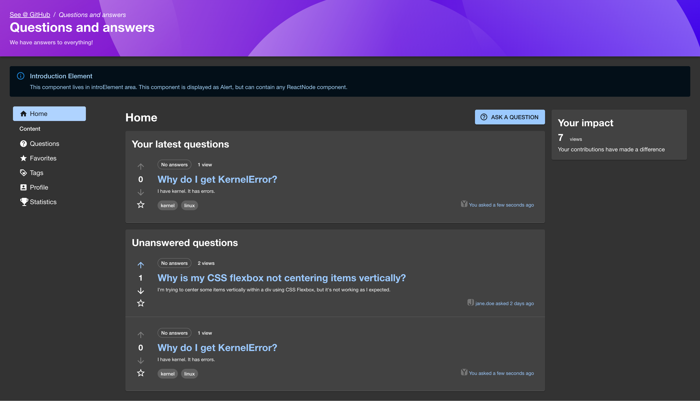

Questions page:

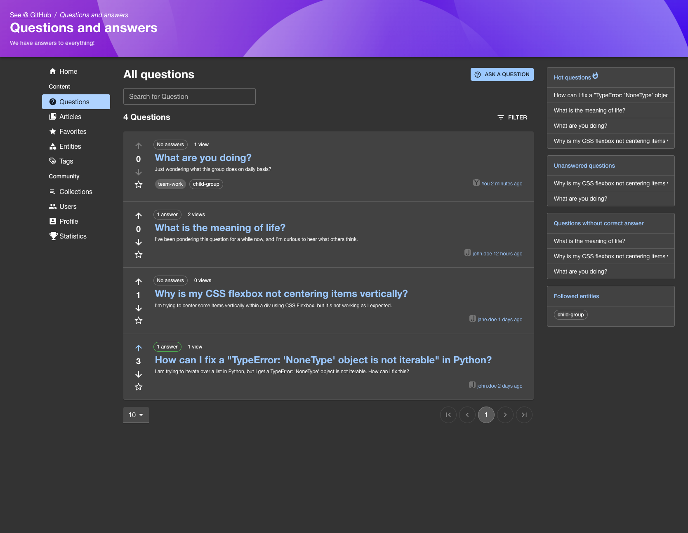

Posting question:

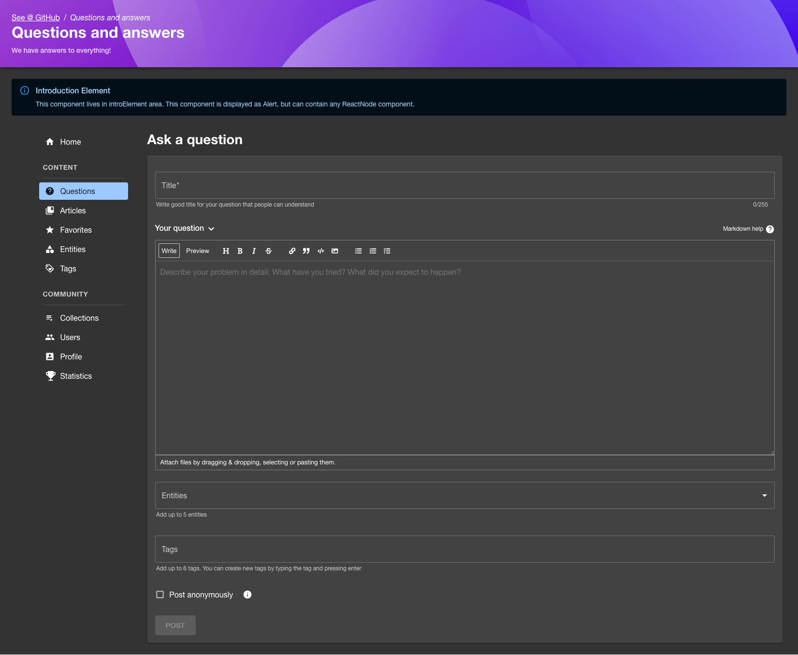

Answering question:

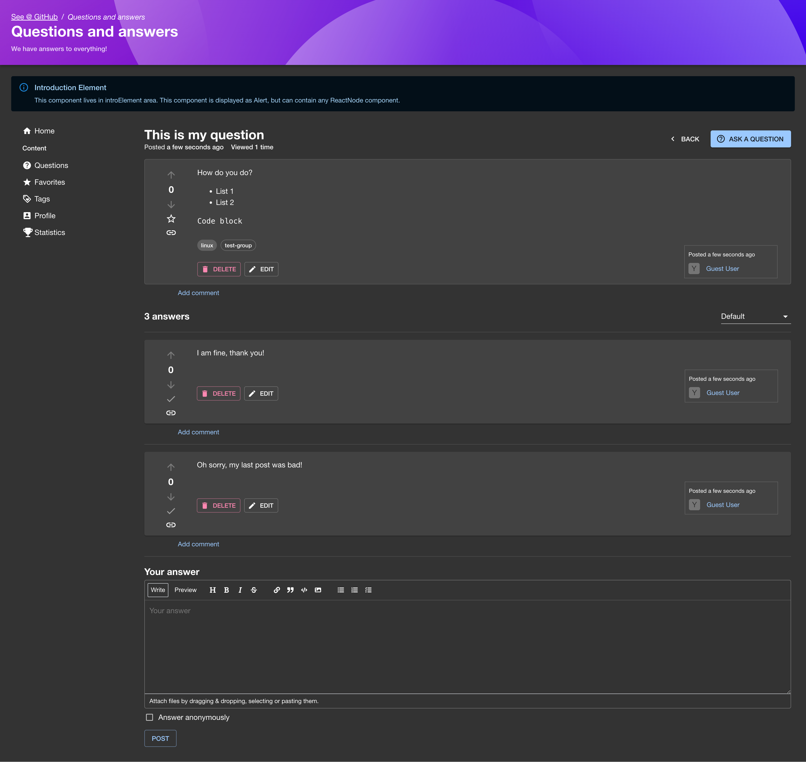

Adding to collection

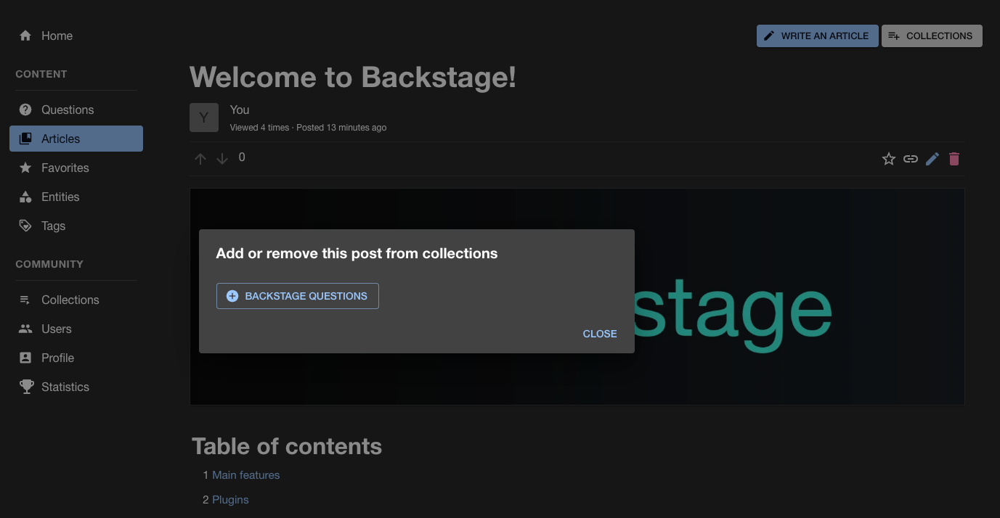

Articles page:

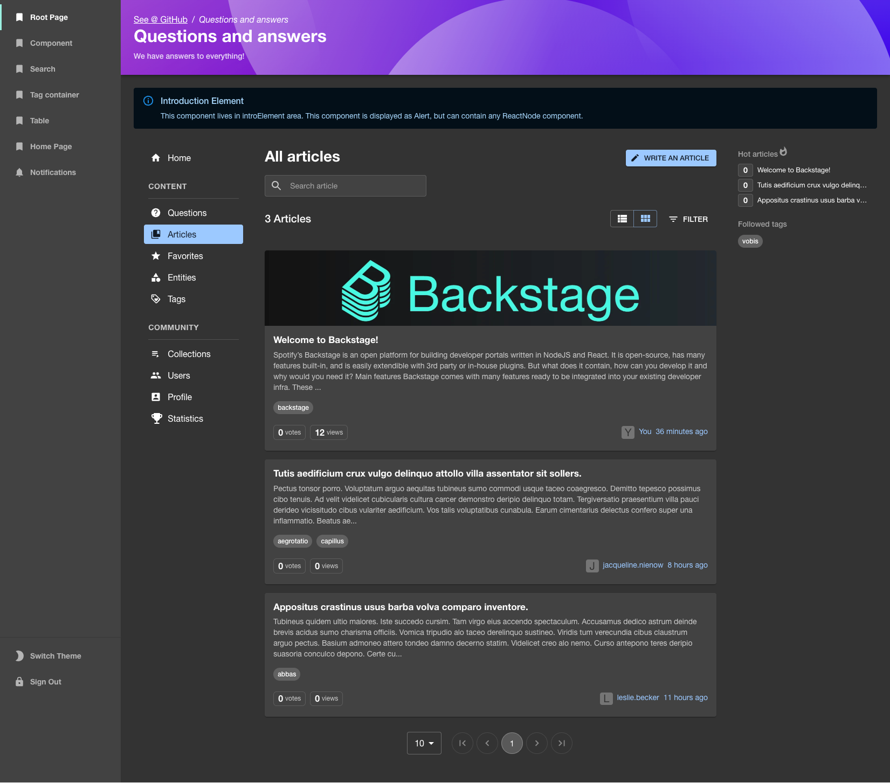

Article page:

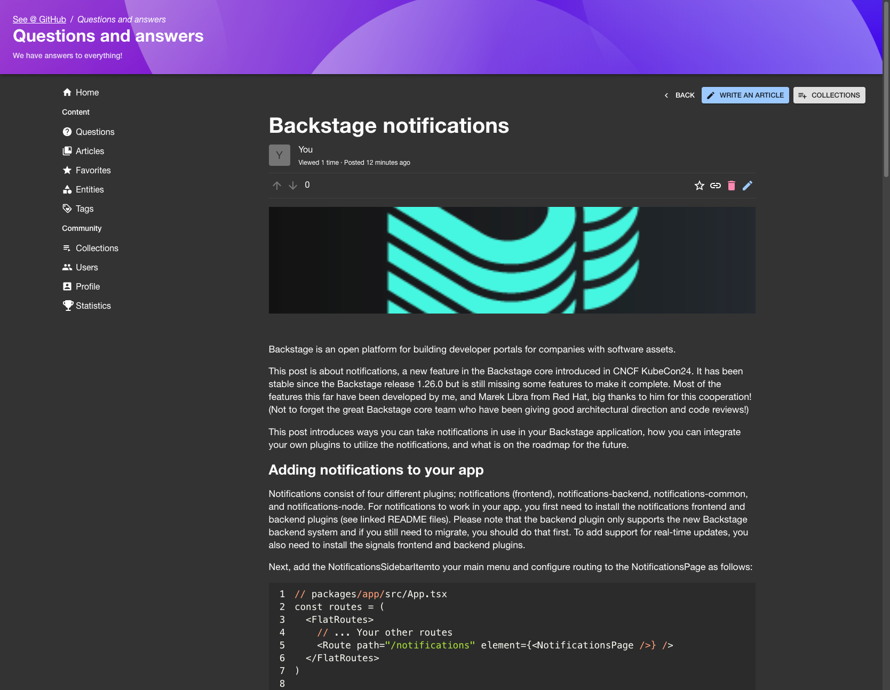

Collections page:

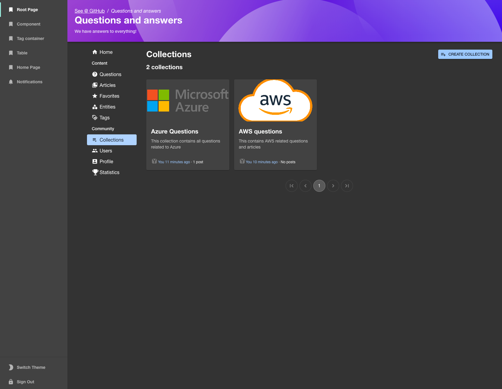

Collection page:

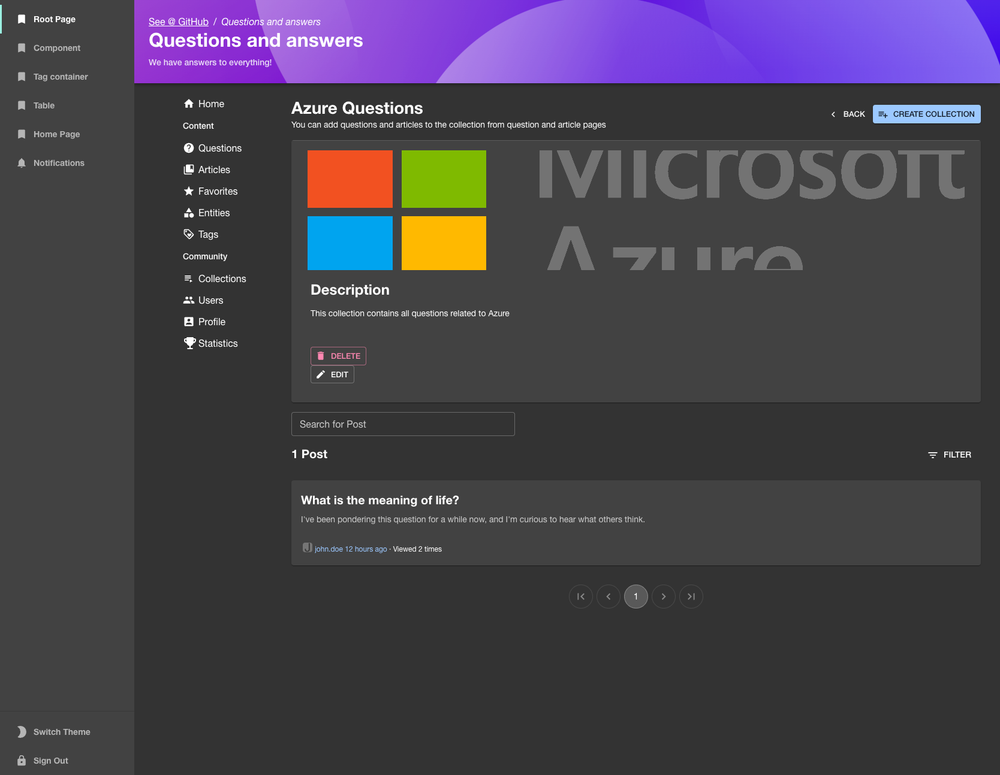

Entities page:

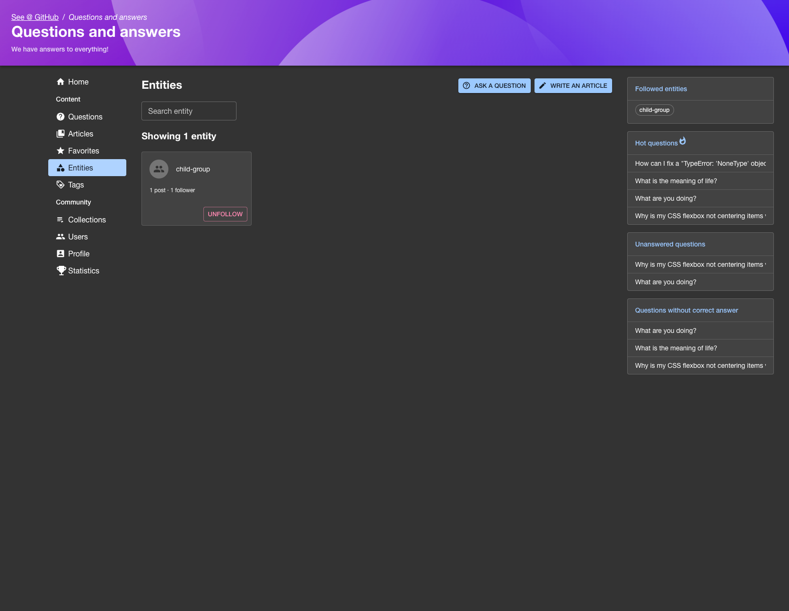

Entity page:

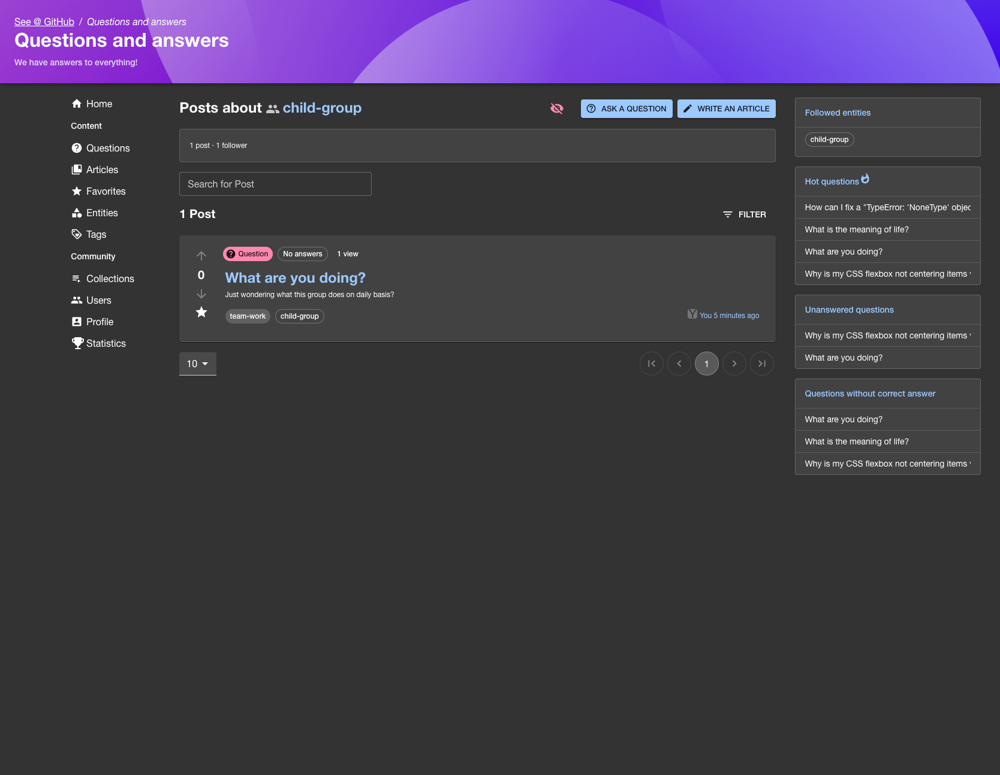

Users page:

Profile page:

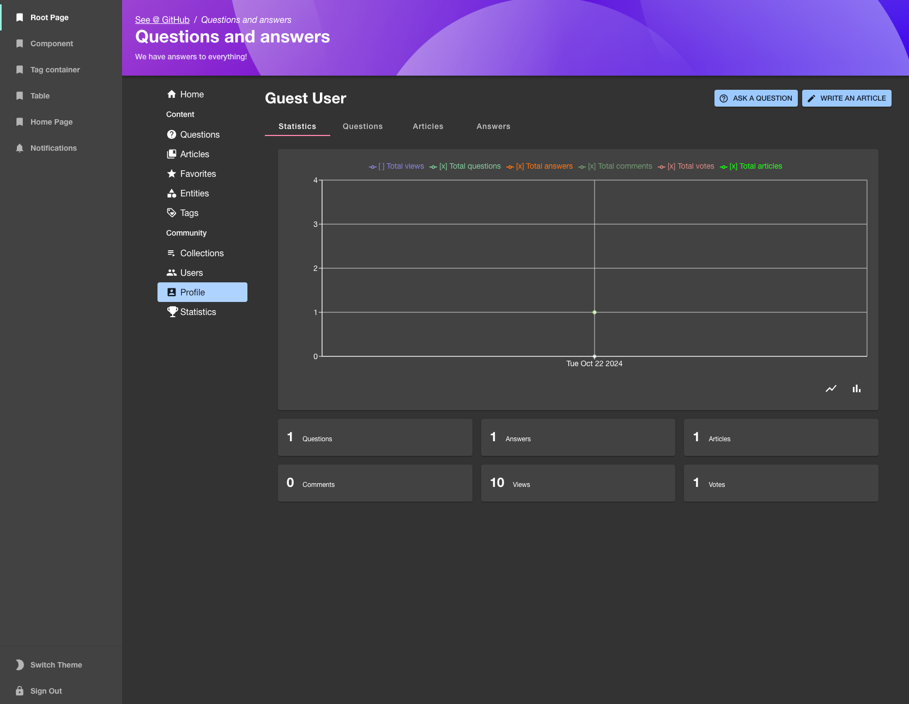

Stats page:

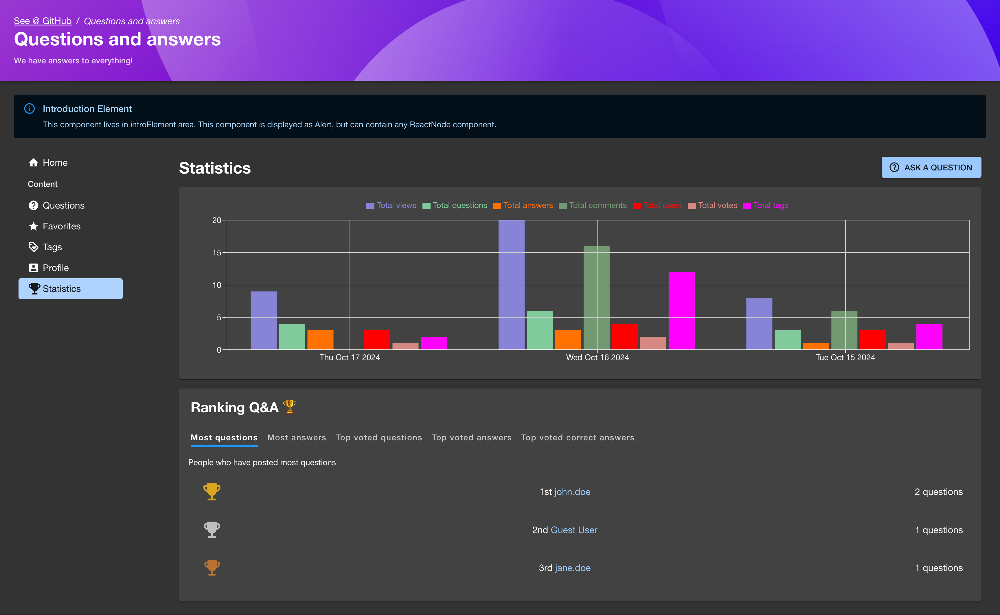

Tags page:

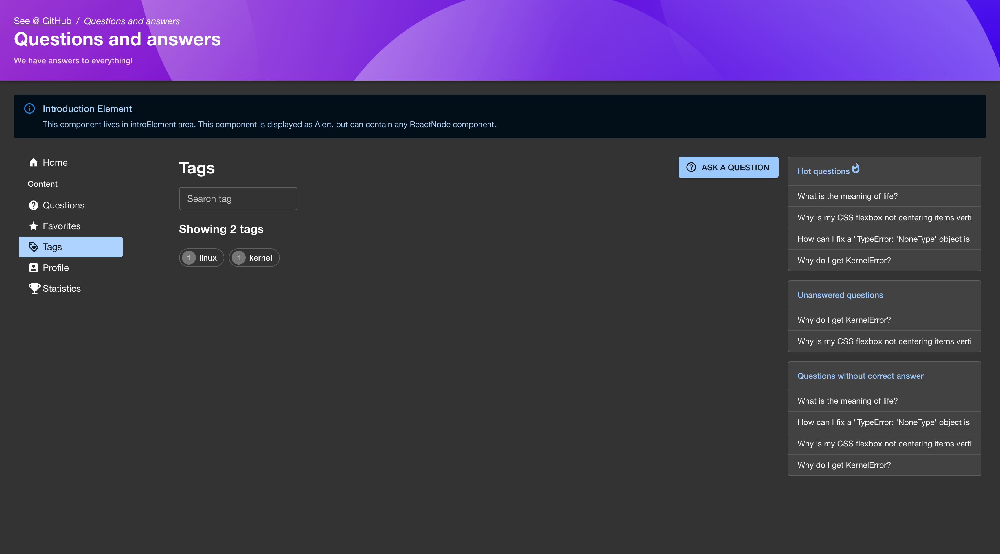

## Contributing

All contributions are very welcome. See [CONTRIBUTING](CONTRIBUTING.md) for more information.

## License

This library is under the [MIT](LICENSE) license.
