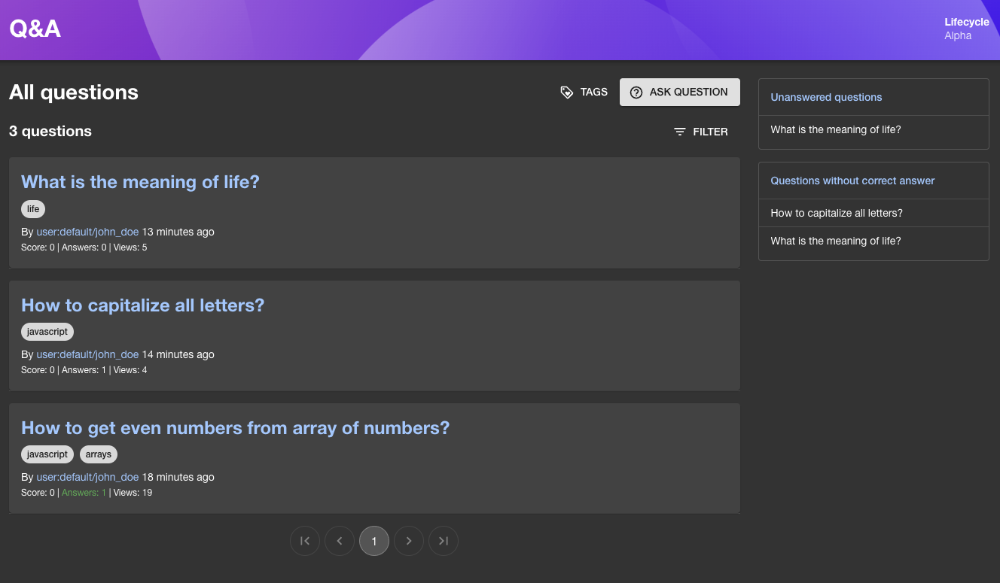
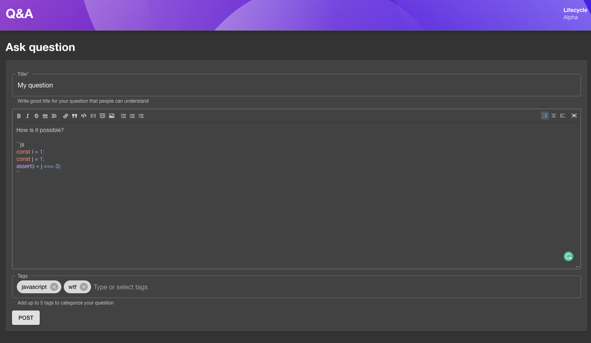
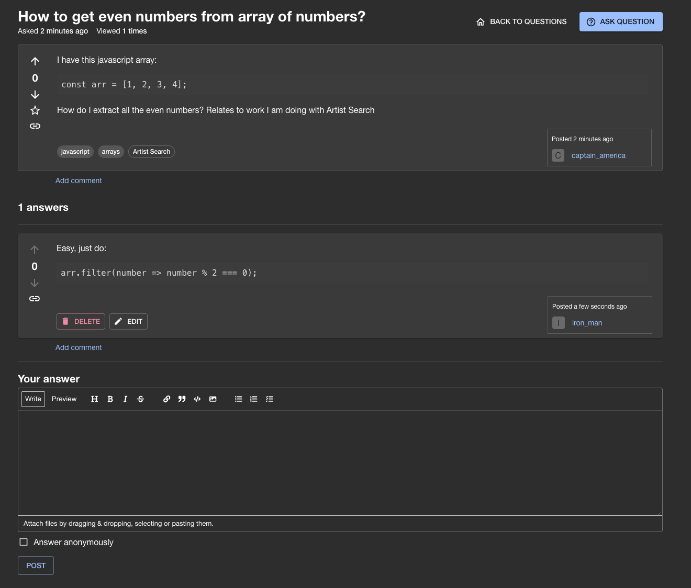
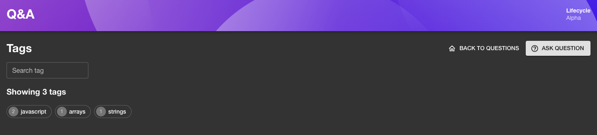

# backstage-plugin-qeta

**Please note: This plugin is under heavy development and in alpha. Breaking changes can occur also during semantic patch version updates**

Backstage.io plugin for Q&A. This plugin is both frontend and backend that manages and displays questions and answers
within Backstage. This plugin provides:

- Interface to ask questions
- Interface to answer questions
- Interface to vote questions and answers
- Interface for individual users and tags
- Backend that saves questions and answers to desired database
- Integration with the [`@backstage/plugin-search`](https://github.com/backstage/backstage/tree/master/plugins/search) plugin
- Integration with the [`@backstage/plugin-catalog-react`](https://github.com/backstage/backstage/tree/master/plugins/catalog-react) plugin

## Setup

Find [installation instructions](./docs/index.md#installation) in our documentation.

## Examples

Questions list:

Posting question:

Answering question:

Tags page:

## Contributing

All contributions are very welcome. See [CONTRIBUTING](CONTRIBUTING.md) for more information.

## License

This library is under the [MIT](LICENSE) license.
