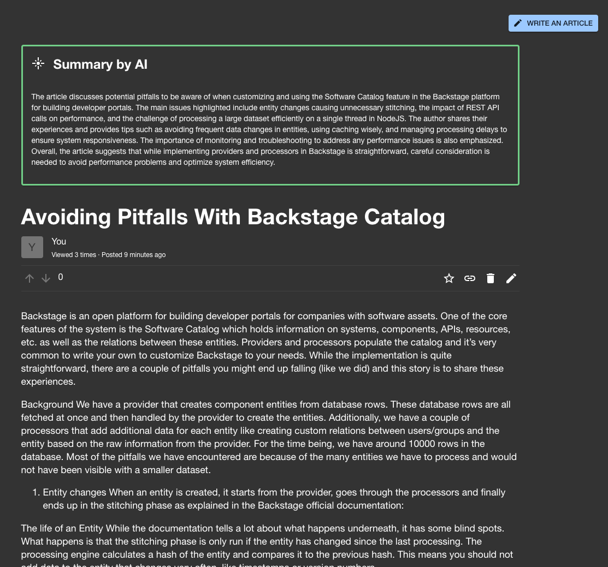

# Artificial Intelligence integration

To utilize the AI capabilities of the plugin, you must create a new backend module that will handle the AI requests.
In short, it should look like this:

```ts
import { qetaAIExtensionPoint } from '@drodil/backstage-plugin-qeta-node';

backend.add(
  createBackendModule({
    pluginId: 'qeta',
    moduleId: 'example-ai-handler',
    register(reg) {
      reg.registerInit({
        deps: {
          ai: qetaAIExtensionPoint,
        },
        async init({ ai }) {
          ai.setAIHandler({
            /**
             This function is used to answer an existing question that is already in the database.
             The result will be shown in the question page.
             */
            async answerExistingQuestion(question, options) {
              if (options.credentials) {
                // The callee credentials will be passed here so you can do additional checks
                // for authorization if needed
              }
              // Your AI logic here, call API, run a model, etc.
              return { answer: 'Answer' };
            },
            /**
             This function is used to answer a new question that is not in the database but is
             still being written in the Ask a question page. The result will be shown in the 
             bottom of the ask form.
             */
            async answerNewQuestion(title, content, options) {
              // Your AI logic here, call API, run a model, etc.
              return {
                answer: 'Answer',
              };
            },
            /**
             This function is used to summarize articles in the article page. The result
             will be shown before the article contents once loaded.
            */
            async summarizeArticle(
              article: Article,
              options?: {
                credentials?: BackstageCredentials<BackstageUserPrincipal>;
              },
            ): Promise<AIResponse> {
              return { answer: 'This article is about the meaning of life' };
            },

            async suggestTags(
              title: string,
              content: string,
              options?: {
                credentials?: BackstageCredentials<BackstageUserPrincipal>;
              },
            ): Promise<{ tags: string[] }> {
              return { tags: ['github', 'logging'] };
            },
          });
        },
      });
    },
  }),
);
```

Of course, it makes sense to create a separate module for this functionality, but this is the basic idea.

This will show the recommended answer on the question page. More AI features will be added in the future and you can
select which ones to use by implementing the `AiHandler` interface.

This is how the UI will look like for new questions (`answerNewQuestion`):


Existing questions (`answerExistingQuestion`):


Summarizing articles (`summarizeArticle`):



## OpenAI module

The OpenAI module is a reference implementation of the AI backend module. It uses the OpenAI API to answer questions.
To use it, you need to install the module and add it to your backend.

```bash
yarn workspace backend add @drodil/backstage-plugin-qeta-backend-module-openai
```

Next, add it to your `packages/backend/src/index.ts`:

```ts
import { createBackend } from '@backstage/backend-defaults';
const backend = createBackend();
// ... other plugins
backend.add(import('@drodil/backstage-plugin-qeta-backend-module-openai'));
backend.start();
```

Additionally, you need to add the necessary config to your `app-config.yaml`:

```yaml
qeta:
  openai:
    apiKey: 'your-openai-key'
```

The config also allows to set the model, temperature, max tokens, and custom endpoint for the OpenAI API.

```yaml
qeta:
  openai:
    answer:
      newQuestions: false # disables/enables answer in ask a question page
      existingQuestions: true # disables/enables answer in question page
      articleSummary: false # disables/enables article summaries by AI
    post:
      tagSuggestions: false # disables/enables tag suggestions by AI
    project: 'your-open-ai-project'
    organization: 'your-open-ai-organization'
    model: 'gpt-4o-mini' # defaults to gpt-3.5-turbo
    temperature: 0.5
    maxTokens: 100
    cacheTtl: # Time answers for existing questions and article summaries are cached
      hours: 12
    prompts:
      # System prompt to add for the AI to answer the question
      system: 'You are a chat bot called Mylly. You should behave. You should be helpful. You should be polite.'
      # Additional prefix to add to the user input
      userPrefix: 'My question is this:\n'
      # Additional suffix to add to the user input
      userSuffix: '\nMylly, what is the answer?'
```
